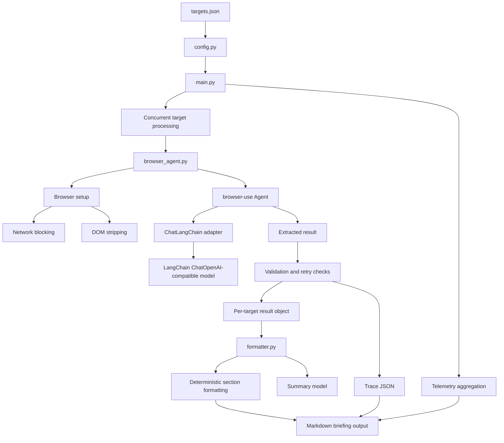

# ARCHITECTURE

## 1. Project Purpose

OmniBrief solves the problem of collecting reliable, high-signal information from dynamic websites and turning it into a structured Markdown morning briefing.

The main challenge is that modern websites are not clean text sources. They contain scripts, hidden nodes, cookie banners, navigation chrome, advertisements, unloaded skeleton components, tracking elements, sidebars, and asynchronously hydrated content. A simple scraper can miss the real data, while an AI browser agent can become slow and token-heavy if it receives the full noisy DOM.

The implementation solves this by combining:

1. A browser-control extraction agent for difficult live website interaction.
2. A stronger extraction model for reasoning-heavy navigation and dynamic page understanding.
3. A smaller summary model for final writing after the content has already been extracted.
4. DOM and network minimization to reduce unnecessary browser context.
5. Deterministic formatting to keep the final report stable and professional.
6. Trace and telemetry recording so every run is observable and auditable.

---

## 2. High-Level Architecture



The project uses a layered architecture rather than one large scraping script. Each file owns a clear responsibility:

| Layer                          | File                   | Responsibility                                                                                                                                    |
| ------------------------------ | ---------------------- | ------------------------------------------------------------------------------------------------------------------------------------------------- |
| Configuration layer            | `config.py`            | Loads environment variables, model settings, browser flags, optimization flags, and target definitions.                                           |
| Orchestration layer            | `main.py`              | Starts a run, creates a run ID, creates trace folders, processes targets concurrently, aggregates telemetry, and calls the report generator.      |
| Browser extraction layer       | `browser_agent.py`     | Creates the browser session, prepares optimization hooks, runs the `browser-use` agent, validates output, retries weak results, and saves traces. |
| LLM adapter layer              | `langchain_adapter.py` | Converts `browser-use` messages into LangChain messages, handles text-only model support, invokes the chat model, and records token usage.        |
| Formatting and synthesis layer | `formatter.py`         | Builds the final Markdown report, runs the summary model, formats target sections, standardizes weather/Hacker News output, and adds telemetry.   |
| Observability layer            | `telemetry.py`         | Stores token usage, per-call LLM traces, total usage, and JSON-safe trace data.                                                                   |

---

## 3. Problem-Solving Strategy

The first design idea was cost-first: use smaller or cheaper models for extraction and reserve a stronger model for summarization. Benchmarking showed that this was unreliable because browser extraction is not just text parsing. It requires agentic reasoning over page state, hydration timing, hidden elements, links, comments, metrics, and incomplete UI.

The implemented solution reverses that assumption:

1. Use the stronger model where the environment is messy: browser extraction.
2. Use the smaller model where the input is already stabilized: final summarization.
3. Reduce the extraction model's burden using DOM/context minimization before the model sees page content.
4. Keep final report formatting mostly deterministic so the summary model does not control the whole document structure.

This creates a production-oriented pattern:

```text
Messy live web page -> optimized browser context -> strong extraction model -> clean extracted facts -> small summary model -> deterministic Markdown report
```

---

## 4. Step-by-Step Implementation Flow

### Step 1: Load configuration and targets

The run starts from `main.py`, which calls `load_targets()` from `config.py`.

`config.py` performs these tasks:

1. Loads `.env` using `python-dotenv`.
2. Reads provider settings such as `API_KEY`, `BASE_URL`, `LLM_MODEL`, and `SUMMARY_MODEL`.
3. Reads browser settings such as `HEADLESS_MODE`, `AGENT_USE_VISION`, `AGENT_USE_JUDGE`, and `AGENT_MAX_FAILURES`.
4. Reads optimization settings such as `AGENT_CONTEXT_MINIMIZATION` and `AGENT_INCLUDE_ATTRIBUTES`.
5. Loads `targets.json` and validates that every target has:

   * `name`
   * `url`
   * `extraction_prompt`

This means the extraction pipeline is data-driven. To add a new website, the user does not need to rewrite the pipeline; they add another target object with a URL and extraction prompt.

### Step 2: Create a run identity and trace folder

`main.py` creates a professional run ID using this pattern:

```text
omnibrief-morning-briefing_YYYY-MM-DD_HH-MM-SS
```

The same run ID is used for:

1. The final Markdown report.
2. The trace directory.
3. Logging and audit references.

This keeps every generated report connected to its supporting trace files.

### Step 3: Process all targets concurrently

`main.py` creates one async task per target and runs them with `asyncio.gather()`.

This solves the latency problem. Instead of processing Wikipedia, Hacker News, and BBC Weather one after another, the system starts extraction jobs concurrently. Each target still gets its own isolated extraction result, status, token usage, execution time, and trace file.

If one target fails, the full pipeline does not collapse. `_process_target()` catches timeouts and general exceptions and returns a failure result for that one target.

### Step 4: Build the extraction task prompt

For each target, `browser_agent.py` builds a browser-agent task using `_build_task()`.

The prompt includes:

1. The target name.
2. The target URL.
3. The target-specific extraction prompt.
4. Instructions to read actual visible page content.
5. Instructions to return only the extracted result.
6. Guardrails against returning generic labels such as `Homepage` or the site name.

When context minimization is enabled, the task also includes DOM minimization instructions. These instructions tell the agent to ignore boilerplate and focus on dense visible text, metrics, timestamps, scores, comment counts, weather values, and data-bearing links.

### Step 5: Create an optimized browser session

`browser_agent.py` builds a fresh `browser-use` `Browser` instance for each extraction attempt.

The browser is configured for:

1. Headless operation controlled by `HEADLESS_MODE`.
2. No storage state persistence.
3. No automatic PDF downloads.
4. No visual element highlighting.
5. Ephemeral cleanup after the run.

A fresh browser session per attempt improves reliability because retries do not inherit broken page state, killed browser sessions, detached targets, or stale storage.

### Step 6: Apply network-level optimization

Before the agent runs, `_install_network_blocking()` uses the browser CDP session to block heavy and low-value resources.

Blocked resource patterns include:

```text
*.png, *.jpg, *.jpeg, *.gif, *.svg, *.css, *.woff, *.woff2, *.ttf
```

This helps because the extraction task is text-focused. Images, fonts, and stylesheets usually increase load time without improving text extraction. Blocking them reduces page overhead and helps the browser reach useful textual content faster.

### Step 7: Apply DOM-level context minimization

`browser_agent.py` defines `DOM_STRIPPING_SCRIPT`, which marks noisy DOM elements with `data-browser-use-exclude="true"`.

The script excludes:

```text
svg, script, style, footer, nav, noscript, iframe,
[hidden], [aria-hidden='true'], display:none, visibility:hidden
```

It also installs a `MutationObserver`, so dynamically added noisy nodes are marked after page load as well. This is important for modern sites because content and layout elements can be inserted after initial navigation.

This layer reduces the amount of irrelevant page context that the model sees. It is one of the core optimization techniques in the current implementation.

### Step 8: Run the browser-use extraction agent

`_run_agent_for_target()` constructs a `browser-use` `Agent` with:

1. The generated extraction task.
2. The optimized browser instance.
3. The custom `ChatLangChain` LLM adapter.
4. Initial actions that navigate directly to the URL and evaluate the DOM stripping script.
5. Vision mode controlled by `AGENT_USE_VISION`.
6. Judge mode controlled by `AGENT_USE_JUDGE`.
7. Failure limit controlled by `AGENT_MAX_FAILURES`.
8. Attribute exposure controlled by `AGENT_INCLUDE_ATTRIBUTES` when context minimization is enabled.

The current attribute allowlist is:

```text
href, src, id, aria-label, title, alt
```

This is a middle-ground optimization. It keeps useful navigation and semantic attributes while avoiding a large amount of noisy markup.

### Step 9: Adapt browser-use messages to LangChain

`langchain_adapter.py` implements `ChatLangChain`, which subclasses the `browser-use` `BaseChatModel` interface.

This adapter solves compatibility between:

1. `browser-use`, which expects its own message and response types.
2. LangChain chat models, specifically OpenAI-compatible chat models.
3. Third-party providers that may not accept all browser-use runtime arguments.
4. Text-only models that do not support image payloads.

The adapter performs these tasks:

1. Converts browser-use user, system, and assistant messages into LangChain `HumanMessage`, `SystemMessage`, and `AIMessage` objects.
2. Strips or converts image content when `AGENT_USE_VISION=false`.
3. Filters unsupported invocation kwargs, keeping only safe options such as `config` and `stop`.
4. Supports normal text completion.
5. Supports structured-output invocation when available.
6. Extracts token usage from provider metadata.
7. Records every model call into the telemetry recorder.

This adapter is a key engineering layer because it allows OmniBrief to use OpenAI-compatible providers through LangChain while still satisfying the interface expected by `browser-use`.

### Step 10: Extract the final result from the agent history

After the browser agent finishes, `_extract_result_text()` pulls the answer from:

1. `history.final_result()` when available.
2. `history.extracted_content()` as a fallback.
3. A generated error message if neither is available.

This gives the rest of the pipeline a simple string result regardless of how the browser agent internally stored its output.

### Step 11: Validate result quality and retry weak outputs

`browser_agent.py` includes practical validation logic.

The result is treated as weak or failed when:

1. It is empty.
2. It starts with an extraction error.
3. It looks generic, such as `Homepage`, the site name, the domain label, or a short homepage-style response.
4. Judge mode is enabled and the history is not validated.

When a result looks too generic, the system runs a second extraction attempt with a stronger retry prompt. The retry prompt tells the agent that the previous answer was too generic and asks it to extract concrete page content from the DOM or visible text.

This improves reliability without blindly accepting weak agent outputs.

### Step 12: Save a trace file for each target

Every target produces a trace JSON file through `_save_trace()`.

Each trace includes:

1. Target name.
2. Target URL.
3. Extraction prompt.
4. Final status.
5. Final content.
6. Error details when present.
7. Execution time.
8. Telemetry.
9. All extraction attempts.
10. Serialized browser-use history.

This makes the system auditable. If a report looks wrong, the developer can inspect the trace to see what the agent saw, what it returned, how many attempts were made, and how many tokens were consumed.

### Step 13: Aggregate run-level telemetry

After all target tasks finish, `main.py` aggregates token usage across the returned result objects.

The aggregated telemetry includes:

1. Total prompt tokens.
2. Total completion tokens.
3. Total combined tokens.
4. Total execution time.

This telemetry is passed to `generate_markdown_report()` and included in the final report.

### Step 14: Generate executive summary

`formatter.py` separates successful results from failed ones using `_successful_result_text()`.

Only successful extracted content is passed into the summary model. The summary prompt is strict:

1. Write exactly three concise paragraphs.
2. Use a neutral, professional, analytical journalistic tone.
3. Do not include headings, preambles, postambles, bullet points, or tables.
4. Do not repeat the executive summary title.
5. Do not invent facts, dates, metrics, weather values, or reactions.
6. Acknowledge only what is available.

This keeps the smaller summary model constrained. It is used for synthesis, not for controlling the whole report structure.

### Step 15: Format each result deterministically

The final Markdown report is built by deterministic Python functions in `formatter.py`.

The formatter handles:

1. Report header.
2. Generated timestamp.
3. Run ID.
4. Trace folder link.
5. Executive summary section.
6. One section per target.
7. Source links.
8. Per-target trace links.
9. Status labels.
10. Unavailable-state blocks.
11. Telemetry and cost section.

There are also target-specific formatters:

1. `_format_weather_content()` standardizes high, low, current conditions, precipitation, wind, alerts, and additional details.
2. `_format_hacker_news_content()` restructures story title, points, comments, and community reaction.
3. `_strip_duplicate_summary_heading()` removes repeated summary headings if the summary model accidentally returns one.

This is important because it prevents the final Markdown report from depending entirely on LLM formatting behavior.

### Step 16: Write the final Markdown briefing

The final report is written to:

```text
output/omnibrief-morning-briefing_YYYY-MM-DD_HH-MM-SS.md
```

The report links back to the trace folder and individual trace files. This creates a complete artifact chain from source extraction to final summary.

---

## 5. Implemented Layers

### 5.1 Configuration Layer

Implemented in `config.py`.

Responsibilities:

1. Provider-neutral API configuration.
2. Model selection.
3. Browser behavior flags.
4. Agent behavior flags.
5. Optimization flags.
6. Target file loading and validation.

Key design benefit:

```text
Runtime behavior can be changed from .env and targets.json without editing the core pipeline.
```

### 5.2 Orchestration Layer

Implemented in `main.py`.

Responsibilities:

1. Start the full run.
2. Create a run ID.
3. Create the trace folder.
4. Process targets concurrently.
5. Catch per-target failures.
6. Aggregate usage.
7. Generate the final report.

Key design benefit:

```text
The pipeline is resilient because one failed target does not stop the whole briefing.
```

### 5.3 Browser Preparation Layer

Implemented in `browser_agent.py`.

Responsibilities:

1. Create browser sessions.
2. Disable storage persistence.
3. Block heavy resources.
4. Inject DOM stripping scripts.
5. Prepare initial navigation and page cleanup actions.

Key design benefit:

```text
The extraction model receives a cleaner and lighter browser context.
```

### 5.4 Agentic Extraction Layer

Implemented in `browser_agent.py` using `browser-use`.

Responsibilities:

1. Navigate websites.
2. Observe page content.
3. Handle dynamic UI state.
4. Follow links when required by the task.
5. Return clean extracted content.

Key design benefit:

```text
The system can work with dynamic websites where simple requests-based scraping is insufficient.
```

### 5.5 LLM Adapter Layer

Implemented in `langchain_adapter.py`.

Responsibilities:

1. Convert browser-use messages to LangChain messages.
2. Support OpenAI-compatible models.
3. Handle text-only model mode.
4. Remove unsupported provider kwargs.
5. Record token usage and response metadata.
6. Support structured output when available.

Key design benefit:

```text
The browser agent can use flexible LangChain-compatible model providers without losing telemetry.
```

### 5.6 Validation and Retry Layer

Implemented in `browser_agent.py`.

Responsibilities:

1. Detect empty or error outputs.
2. Detect generic homepage-style answers.
3. Retry with a stronger prompt when the first answer is too generic.
4. Preserve attempt history in traces.

Key design benefit:

```text
The pipeline avoids silently accepting low-quality extraction results.
```

### 5.7 Trace and Telemetry Layer

Implemented across `browser_agent.py`, `langchain_adapter.py`, and `telemetry.py`.

Responsibilities:

1. Track prompt, completion, and total tokens.
2. Record each LLM call.
3. Convert complex objects into JSON-safe trace data.
4. Save per-target extraction traces.
5. Add run-level telemetry to the final report.

Key design benefit:

```text
Each result is inspectable, measurable, and debuggable.
```

### 5.8 Formatting and Synthesis Layer

Implemented in `formatter.py`.

Responsibilities:

1. Generate the executive summary.
2. Normalize extracted content.
3. Apply target-specific formatting rules.
4. Build Markdown sections.
5. Add trace links and telemetry.
6. Save the final report.

Key design benefit:

```text
The final report remains stable even when raw extraction output varies.
```

---

## 6. Current Optimization Techniques

### 6.1 Dual-LLM Model Routing

The architecture uses separate models for separate task types:

| Stage      | Model Role     | Why                                                               |
| ---------- | -------------- | ----------------------------------------------------------------- |
| Extraction | Stronger model | Browser navigation and dynamic DOM reasoning are hard.            |
| Summary    | Smaller model  | Input is already cleaned and reduced, so final writing is easier. |

This avoids the failed assumption that cheap extraction is always cheaper in practice. A weaker extraction model can cause retries, timeouts, incomplete data, and higher operational cost.

### 6.2 DOM Stripping

The DOM stripping script marks low-value nodes as excluded:

1. Scripts.
2. Styles.
3. SVGs.
4. Footers.
5. Navigation.
6. Hidden elements.
7. Iframes.
8. Noscript blocks.

A `MutationObserver` keeps applying this exclusion to dynamically inserted nodes.

### 6.3 Network Blocking

The browser blocks heavy assets such as images, CSS, fonts, and SVGs.

This reduces:

1. Page load overhead.
2. Rendering noise.
3. Browser execution cost.
4. Irrelevant context around the actual text.

### 6.4 Attribute Allowlisting

When context minimization is enabled, only useful attributes are exposed:

```text
href, src, id, aria-label, title, alt
```

This preserves navigation and semantic clues without sending every DOM attribute to the model.

### 6.5 Text-Only Model Support

`AGENT_USE_VISION=false` is the default. The adapter removes or converts image inputs before they reach providers that do not support vision messages.

This prevents failures such as unsupported `image_url` payloads when using text-only third-party models.

### 6.6 Prompt Guardrails

The extraction prompt instructs the agent to:

1. Read actual visible content.
2. Return only extracted results.
3. Avoid generic site labels.
4. Return `not available` instead of guessing.
5. Ignore boilerplate and hidden elements.

The summary prompt instructs the summary model to:

1. Use exactly three paragraphs.
2. Avoid headings and filler.
3. Avoid invented facts.
4. Use a neutral journalistic tone.

### 6.7 Deterministic Formatting

The final document structure is generated by code rather than left to the LLM.

This prevents common output problems:

1. Duplicate headings.
2. Missing telemetry.
3. Inconsistent weather labels.
4. Inconsistent failure states.
5. Raw unstructured Hacker News content.

### 6.8 Per-Target Isolation

Each target extraction is isolated with its own result object, trace, status, and exception handling.

This means one failed website does not prevent successful websites from appearing in the final report.

### 6.9 Fresh Browser Sessions for Attempts

Every extraction attempt creates and closes its own browser session.

This reduces issues caused by stale browser state, killed sessions, storage persistence, and detached browser targets.

### 6.10 Telemetry-Driven Benchmarking

The implementation records token and timing data. The README reports that the optimized DOM minimization run reduced token usage and execution latency while keeping successful completion.

This turns optimization into a measurable engineering process rather than guesswork.

---

## 7. Data Flow

```text
1. targets.json
   ↓
2. config.py validates each target
   ↓
3. main.py creates run ID and trace directory
   ↓
4. main.py starts concurrent extraction tasks
   ↓
5. browser_agent.py creates optimized browser session
   ↓
6. CDP blocks heavy resources
   ↓
7. DOM stripping script excludes noisy nodes
   ↓
8. browser-use Agent navigates and extracts content
   ↓
9. ChatLangChain calls the configured extraction model
   ↓
10. telemetry.py records model usage
   ↓
11. browser_agent.py validates result and retries if needed
   ↓
12. browser_agent.py saves target trace JSON
   ↓
13. main.py aggregates all target results and token usage
   ↓
14. formatter.py summarizes successful results
   ↓
15. formatter.py builds deterministic Markdown sections
   ↓
16. output/omnibrief-morning-briefing_YYYY-MM-DD_HH-MM-SS.md
```

---

## 8. Failure Handling Strategy

The implementation avoids silent failure.

### Target configuration failures

If a target is missing required fields, the extraction returns a failure result and saves a trace explaining which keys are missing.

### Missing API key

If no `API_KEY` is configured, the extraction returns a failure result and records the issue in a trace.

### Agent extraction errors

If browser extraction raises an exception, the exception is caught, converted into an extraction error message, and saved in the trace.

### Timeout or per-target processing errors

`main.py` catches target-level timeout and general errors, then returns a structured failure object for that target.

### Summary failure

If executive summary generation fails, the formatter returns a summary-unavailable message rather than breaking the whole report.

### Failed targets in final report

Failed targets are shown with an unavailable-state block instead of hallucinated content.

---

## 9. Why the Current Design Works

The current implementation works because it separates unstable work from stable work.

Unstable work includes:

1. Navigating dynamic pages.
2. Waiting for hydrated content.
3. Ignoring hidden or irrelevant UI.
4. Following navigation paths.
5. Avoiding generic homepage answers.

This work is handled by the stronger extraction model inside the browser agent.

Stable work includes:

1. Summarizing already extracted content.
2. Formatting sections.
3. Adding telemetry.
4. Writing Markdown files.

This work is handled by the smaller summary model and deterministic Python formatting.

The result is a balanced system:

```text
Reasoning-heavy where the web is messy.
Cost-conscious where the data is already clean.
Deterministic where consistency matters.
Observable where debugging matters.
```

---

## 10. Key Engineering Decisions

| Decision                                         | Reason                                                           |
| ------------------------------------------------ | ---------------------------------------------------------------- |
| Use `browser-use` instead of plain HTTP scraping | The targets include dynamic and interaction-heavy pages.         |
| Use a strong extraction model                    | Browser control requires reasoning, not only context length.     |
| Use a smaller summary model                      | After extraction, summarization is cheaper and more constrained. |
| Use DOM stripping                                | Reduces noisy context and token pressure.                        |
| Use network blocking                             | Reduces page load and irrelevant browser work.                   |
| Use text-only mode by default                    | Avoids unsupported vision payloads with third-party providers.   |
| Use deterministic formatter functions            | Keeps final Markdown stable and professional.                    |
| Use trace files                                  | Makes each extraction auditable.                                 |
| Use token telemetry                              | Makes cost and optimization measurable.                          |
| Use concurrent processing                        | Reduces total end-to-end runtime.                                |

---

## 11. Current System Strengths

1. Works with dynamic websites rather than only static HTML.
2. Uses model capacity where it has the highest value.
3. Minimizes noisy browser context before LLM processing.
4. Keeps output formatting deterministic and predictable.
5. Records traces for debugging and auditability.
6. Aggregates token usage and runtime metrics.
7. Handles failed targets without breaking the full run.
8. Supports OpenAI-compatible providers through LangChain.
9. Supports text-only models safely.
10. Produces professional Markdown reports with trace links.

---

## 12. Current Limitations

1. The pipeline still depends on website availability and layout stability.
2. Extraction quality depends on the selected `LLM_MODEL`.
3. Some sites may require interaction strategies beyond current target prompts.
4. Network blocking may need adjustment for sites where CSS or images contain meaningful information.
5. The current summary stage only summarizes successful extractions.
6. There is no persistent database; outputs are file-based Markdown and JSON traces.
7. The current architecture is optimized for briefing-style extraction, not full archival crawling.

---

## 13. Extension Points

### Add a new source

Add a new object to `targets.json`:

```json
{
  "name": "Example Source",
  "url": "https://example.com",
  "extraction_prompt": "Extract the most important update from this page."
}
```

### Change extraction model

Update `.env`:

```env
LLM_MODEL=your-extraction-model
```

### Change summary model

Update `.env`:

```env
SUMMARY_MODEL=your-summary-model
```

### Disable context minimization

Update `.env`:

```env
AGENT_CONTEXT_MINIMIZATION=false
```

### Enable vision model behavior

Only enable this if the selected provider supports image inputs:

```env
AGENT_USE_VISION=true
```

### Tune formatting behavior

Modify `formatter.py` to add more target-specific formatting functions similar to:

1. `_format_weather_content()`
2. `_format_hacker_news_content()`

---

## 14. Summary

OmniBrief solves dynamic web briefing generation by treating browser extraction as a reasoning-heavy task and final report writing as a constrained synthesis task.

The architecture is built around five core ideas:

1. Strong model for browser extraction.
2. Smaller model for final summarization.
3. DOM and network minimization before model reasoning.
4. Deterministic formatting after extraction.
5. Full observability through traces and telemetry.

This makes the system more reliable than a simple scraper, more measurable than a black-box agent, and more cost-aware than sending raw full-page DOMs directly into a model without pruning.
